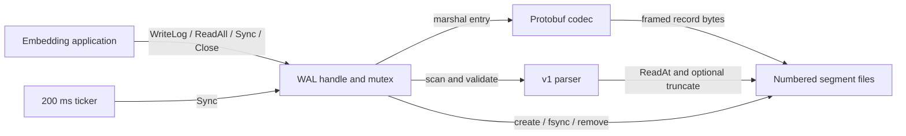
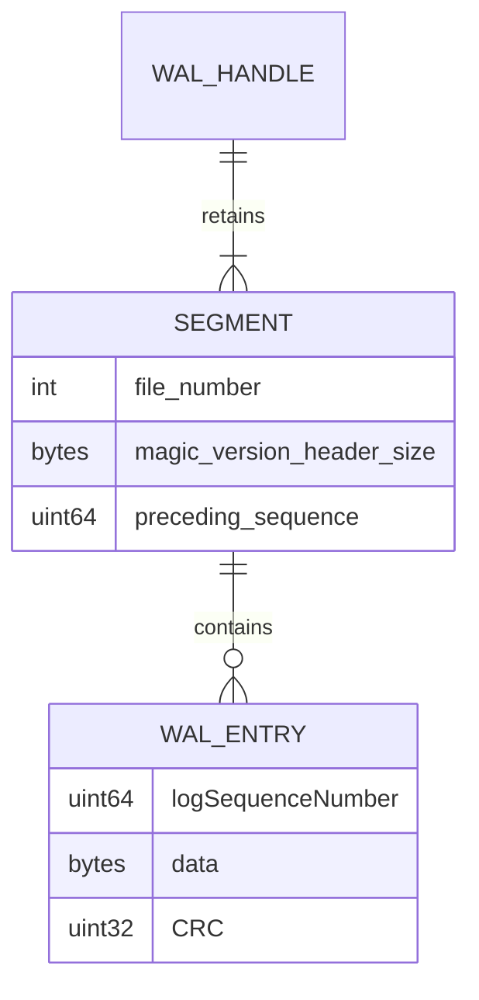
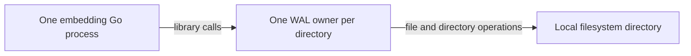

# Architecture

## Overview

One `WAL` handle combines the lock, sequence counter, active file, retention settings and lifecycle state ([definition](../../wal.go#L21)). All persisted state is in numbered files; there is no separate manifest or index. The parser reconstructs the sequence and append offset from headers and records ([scan](../../format.go#L41)).

## Components

| Component | Responsibility | Lives in | Talks to |
| --- | --- | --- | --- |
| Handle and lifecycle | Serialize operations; track active segment, poison and close state. | [Root package](../../), [wal.go](../../wal.go#L21) | Caller, parser, filesystem, ticker |
| Segment management | Discover names, enforce startup continuity, rotate, and delete excess files. | [Root package](../../), [wal.go](../../wal.go#L34) | OS directory and file APIs |
| Format and recovery | Header validation, record framing, sequence/CRC checks, partial-tail truncation. | [Root package](../../), [format.go](../../format.go#L41) | Files and protobuf |
| Schema and generated message | Define/encode sequence, data and CRC. | [Schema](../../wal.proto#L4), [pb folder](../../pb/) | Append and parser |
| Legacy codec facade | Preserve exported panic-based marshal/unmarshal helpers. | [Root package](../../), [util.go](../../util.go#L8) | External callers; not startup recovery |

## Boundaries and contracts

- **Application to library:** `WriteLog` accepts bytes and assigns the next sequence while holding the mutex. Marshaling creates record bytes before returning; callers must avoid mutating the input concurrently during the call ([implementation](../../wal.go#L207)). Errors from invalid input do not poison the handle, while append I/O failures do ([append](../../wal.go#L165)).
- **Library to disk:** A successful append means the record was written through `WriteAt`; successful `Sync` or first `Close` is the explicit fsync boundary. The ticker attempts sync every 200 ms, but scheduling and fsync latency mean this is not a hard durability deadline ([append](../../wal.go#L197), [lifecycle](../../wal.go#L221)).
- **Directory ownership:** Names starting with `wal-` must be canonical nonnegative decimal numbers; unrelated filenames are ignored. Startup requires retained segment numbers and their base sequences to be continuous. There is no cross-process lock ([discovery](../../wal.go#L34), [continuity](../../wal.go#L107), [ownership contract](../../README.md#L20)).
- **Recovery policy:** Only the highest-numbered segment may lose a structurally incomplete final frame on open. Invalid header, oversized length, complete bad protobuf, bad CRC or wrong sequence remains an error ([startup](../../wal.go#L102), [parser](../../format.go#L48)).

## Data model

The handle is an in-memory concept; this diagram is not a database schema.

| Entity | Stored in | Key fields | Defined at |
| --- | --- | --- | --- |
| Handle | Process memory | Active file, end offset, last sequence, limits, mutex, closed/poison flags and stop/done channels | [wal.go:21](../../wal.go#L21) |
| Segment | `wal-N` in configured directory | Bytes 0–7: `WALG`, version 1 and header size 16; bytes 8–15: preceding sequence encoded little endian | [format.go:17](../../format.go#L17), [wal.go:67](../../wal.go#L67) |
| Frame | After the 16-byte header | Little-endian uint32 encoded-body length, then protobuf bytes | [wal.go:197](../../wal.go#L197) |
| Entry | Protobuf body | Sequence, payload and CRC32 IEEE over all eight little-endian sequence bytes followed by payload | [wal.proto:4](../../wal.proto#L4), [format.go:19](../../format.go#L19) |

## State and persistence

New files begin at sequence base zero for `wal-0`; rotated headers persist the last assigned sequence. An empty newest file therefore retains continuity even if retention deletes every older segment ([create](../../wal.go#L67), [test](../../wal_test.go#L94)). Append offsets, locks and lifecycle flags are rebuilt on open, while poison is only in memory and requires closing/reopening the handle ([initialization](../../wal.go#L96), [check](../../wal.go#L132)).

Retention runs at startup and rotation and deletes the oldest files beyond `maxFiles`, then syncs the WAL directory. It is permanent history deletion, independent of any database checkpoint ([retain](../../wal.go#L147)).

## Deployment

Configuration is the three arguments to `WALInit`; the code creates directories with mode `0700` and new files with `0600`, subject to OS permissions. Existing objects are not chmodded. The library syncs the WAL directory when creating/removing segments, but does not sync the newly created directory's parent ([initialize](../../wal.go#L85), [create](../../wal.go#L62)). There is no server, network integration or deployment configuration in the [tracked project inventory](03-structure.md).

## Failure and scale

- A write/rotation/sync failure poisons subsequent operations via `ErrPoisoned`; `Close` still attempts sync and close. The ticker discards its direct error, so a caller learns about poison on the next operation or first close ([fail/check](../../wal.go#L132), [sync loop](../../wal.go#L229)). `Repair` also poisons on scan failure, whereas ordinary read errors do not ([reads and repair](../../wal.go#L256)).
- Startup can truncate the newest incomplete tail before checking cross-segment continuity, because scanning precedes that check. Header damage is never repaired ([wal.go:102](../../wal.go#L102), [format.go:48](../../format.go#L48)).
- One mutex serializes disk I/O as well as writes. `ReadAll` allocates all retained records, and startup's parser also materializes records even though startup discards them, so large logs increase latency and memory usage ([read-all](../../wal.go#L274), [scan](../../format.go#L100)). Independent directories can have independent handles; sharing one directory across handles has no coordination in this implementation.
