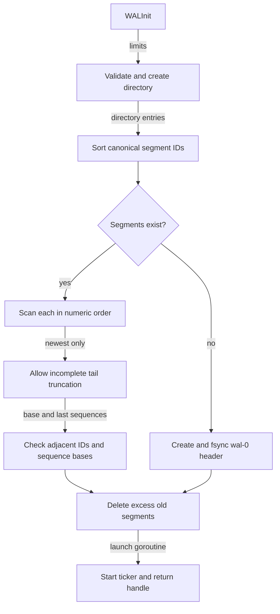
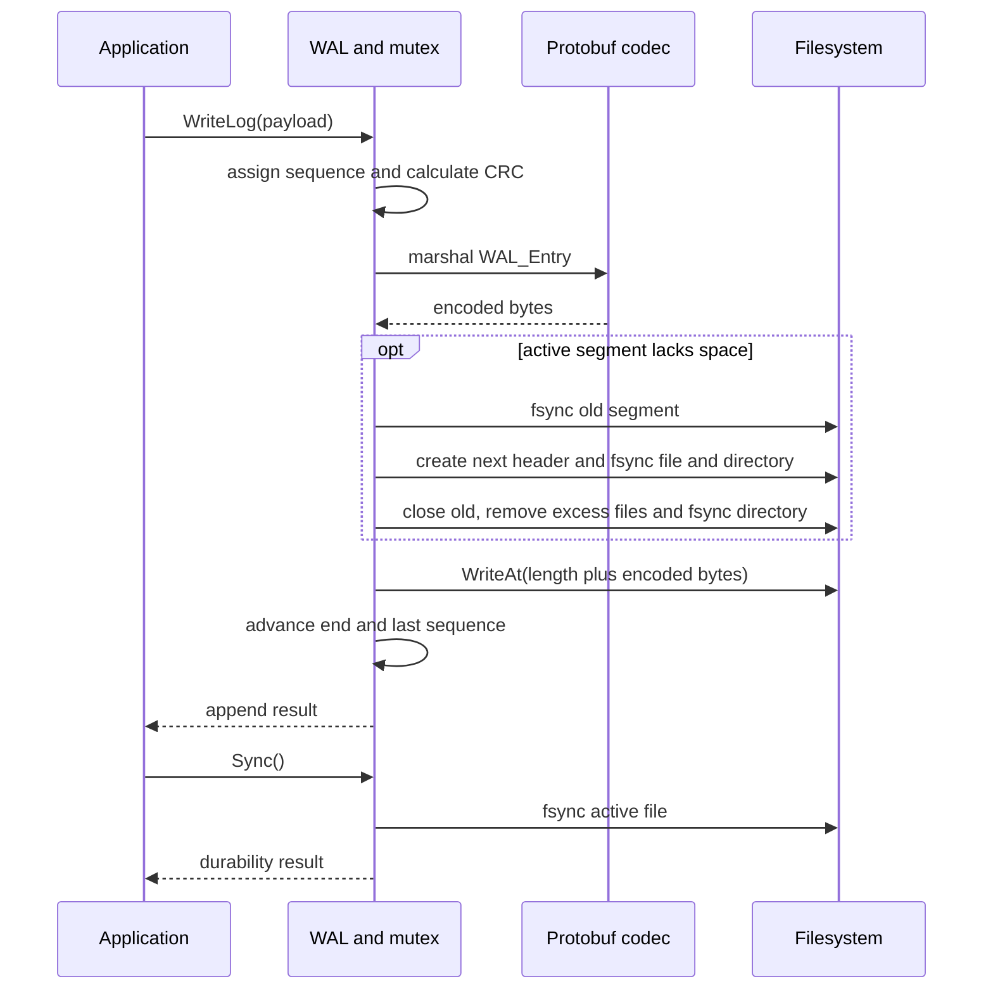
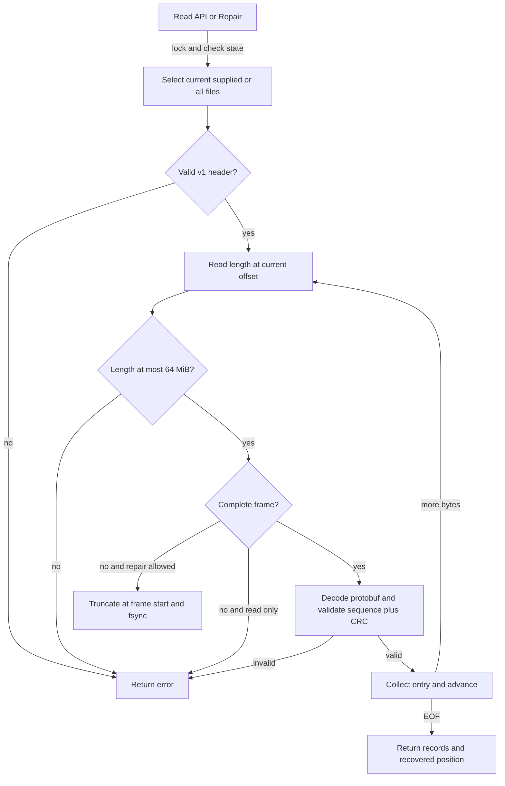
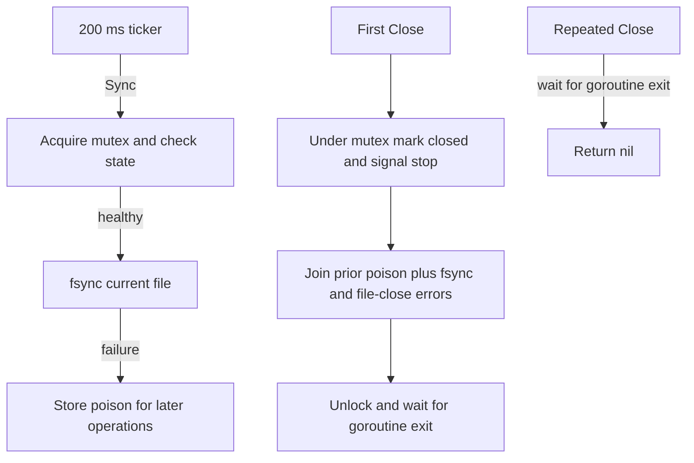
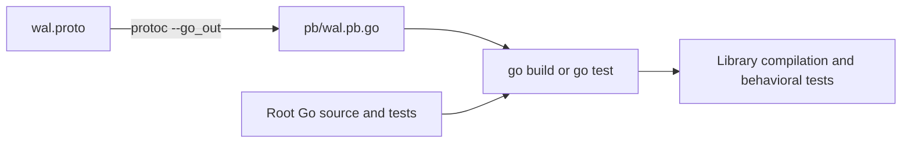

# Flow

## Startup

There is no `main`: the embedding process calls `WALInit` and receives either a ready handle or an error.

1. **Validate arguments and directory:** reject size below 64 or count below one, then create the directory. [wal.go:85](../../wal.go#L85) · [structure](03-structure.md#root-package)
2. **Discover segments:** ignore unrelated names; reject malformed names starting `wal-`; sort IDs numerically. [wal.go:34](../../wal.go#L34) · [structure](03-structure.md#root-package)
3. **Recover existing data:** open each file read/write and parse its v1 header and frames. Only the last file gets `repair=true`. Old/unversioned headers fail here before record-tail repair. [wal.go:97](../../wal.go#L97), [format.go:48](../../format.go#L48) · [structure](03-structure.md#root-package)
4. **Establish continuity:** subsequent IDs must follow the prior ID and their header base must equal the prior last sequence. Adopt the newest file and recovered offset; close earlier files. The oldest retained file may start at any base. [wal.go:107](../../wal.go#L107) · [structure](03-structure.md#root-package)
5. **Bootstrap empty directories:** exclusively create `wal-0`, write the 16-byte header, sync the file and directory. [wal.go:120](../../wal.go#L120), [wal.go:62](../../wal.go#L62) · [structure](03-structure.md#root-package)
6. **Enforce retention and start background sync:** remove excess oldest files and sync the directory, then start the goroutine. Failure returns no usable handle. [wal.go:125](../../wal.go#L125), [wal.go:147](../../wal.go#L147) · [structure](03-structure.md#root-package)

## Append and rotation

1. **Acquire the lock and form the entry:** `WriteLog` assigns `lastSequenceNo+1` and calculates CRC. The legacy entry method instead takes caller-provided sequence/CRC and rejects nil. [wal.go:207](../../wal.go#L207), [format.go:19](../../format.go#L19) · [structure](03-structure.md#root-package)
2. **Validate and encode:** check closed/poison state, payload and sequence limits, next sequence and matching CRC; marshal the [schema](../../wal.proto#L4); reject a record that cannot fit in an empty segment. The ordinary payload cap is `64 MiB - 64 bytes`; segment capacity includes a 16-byte header and four-byte length. [wal.go:165](../../wal.go#L165) · [structure](03-structure.md#root-package)
3. **Rotate if necessary:** sync the old file; create and sync the next header with the current last sequence; sync the directory; close the old file; run retention. I/O errors poison the handle. Retention occurs before the pending record is written. [wal.go:182](../../wal.go#L182), [wal.go:62](../../wal.go#L62) · [structure](03-structure.md#root-package)
4. **Write the frame:** emit length plus protobuf using `writeFull`, which retries positive short writes and rejects a zero-byte write; update offset and sequence only after success. [wal.go:197](../../wal.go#L197), [format.go:27](../../format.go#L27) · [structure](03-structure.md#root-package)
5. **Make accepted data durable:** the caller invokes `Sync`, or waits for successful first `Close`; a successful `WriteLog` alone has not fsynced the new record. [wal.go:221](../../wal.go#L221), [wal.go:242](../../wal.go#L242) · [structure](03-structure.md#root-package)

## Reading and repair

1. **Choose the scope:** `ReadAll` lists every retained segment and concatenates results; the current-file and supplied-file methods scan a single file. All hold the handle mutex and reject closed/poisoned state. [wal.go:256](../../wal.go#L256), [wal.go:274](../../wal.go#L274) · [structure](03-structure.md#root-package)
2. **Validate the header:** files shorter than 16 bytes return `truncated WAL header`; mismatched first eight bytes return `unsupported WAL format; legacy files require explicit migration`. All parser reads use `ReadAt`, preserving the file's cursor. [format.go:41](../../format.go#L41) · [structure](03-structure.md#root-package)
3. **Parse a frame:** bound encoded length to 64 MiB before allocation. An incomplete prefix or payload is `io.ErrUnexpectedEOF` on read; with repair enabled, truncate to the last complete offset and fsync. An oversized length is an error even at the tail. [format.go:63](../../format.go#L63) · [structure](03-structure.md#root-package)
4. **Validate the body:** protobuf-decode, require sequence `last+1`, and compare CRC over sequence and payload. Complete invalid data is never silently removed. Return collected records at EOF. [format.go:92](../../format.go#L92) · [structure](03-structure.md#root-package)
5. **Apply explicit repair:** `Repair` scans only the active file with tail truncation enabled, updating the sequence and offset on success and poisoning on failure. It cannot bypass an already poisoned handle. [wal.go:300](../../wal.go#L300) · [structure](03-structure.md#root-package)

`ReadAll` validates each file internally but does not recheck the inter-file continuity that startup checks. External file modification while open is outside the ownership contract; callers should not treat `ReadAll` as a fresh startup-level integrity audit ([implementation](../../wal.go#L285)).

## Background sync and close

1. **Tick:** the goroutine calls `Sync` every 200 ms; direct errors are discarded but sync failures remain in `poison`. Receiving `stop` exits, stops the ticker and closes `done`. [wal.go:229](../../wal.go#L229) · [structure](03-structure.md#root-package)
2. **First close:** hold the lock, mark closed, close `stop`, evaluate and join prior poison plus final file sync/close errors, unlock, then wait for `done`. [wal.go:242](../../wal.go#L242) · [structure](03-structure.md#root-package)
3. **Repeated close:** wait for `done` and return nil; the first close's error is not replayed. Further ordinary operations return `ErrClosed`. [wal.go:244](../../wal.go#L244), [wal.go:132](../../wal.go#L132) · [structure](03-structure.md#root-package)

## Build and schema generation

1. **Use checked-in generated types:** normal builds need the Go toolchain and declared protobuf dependency, not a generator invocation. [go.mod:3](../../go.mod#L3), [pb/wal.pb.go:1](../../pb/wal.pb.go#L1) · [structure](03-structure.md#pb-folder)
2. **Regenerate when changing the schema:** `bash generate_pb.sh` invokes `protoc --go_out=. wal.proto`; it assumes `protoc` and `protoc-gen-go` are installed and does not pin them. [generate_pb.sh:3](../../generate_pb.sh#L3) · [structure](03-structure.md#root-package)
3. **Test:** `make test` runs `go test .`; the documented stronger command is `go test -race ./...`. Tests exercise retained restart sequence, truncated tail/checksum corruption, concurrent append/close, and an empty newest segment. [Makefile:1](../../Makefile#L1), [wal_test.go:11](../../wal_test.go#L11) · [structure](03-structure.md#root-package)
